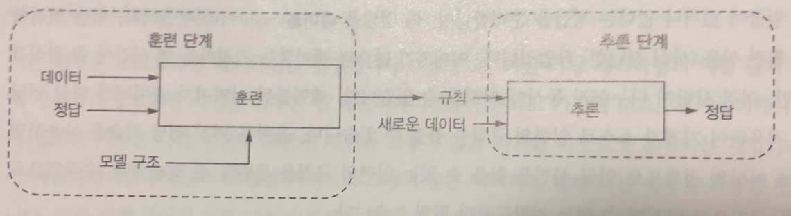
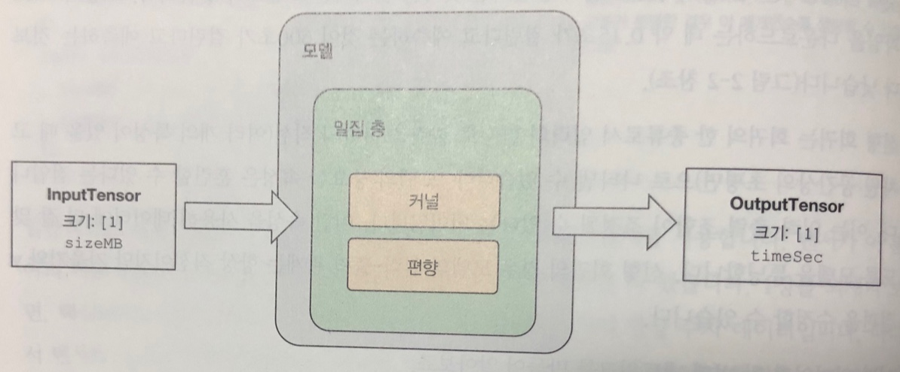
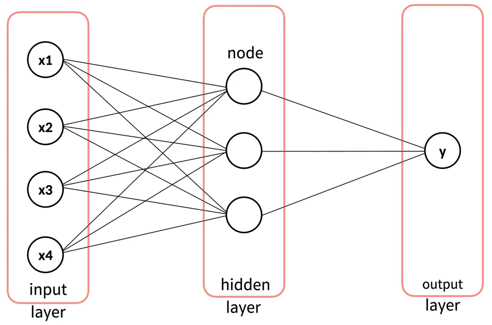

# TensorFlow.js

## 🍌 머신러닝이란?
### 🍓 전통적인 프로그래밍과 머신러닝

> 사용자가 업로드한 사진을 다루는 웹 애플리케이션</br>
> 필요한 기능은 사람 얼굴이 포함된 사진과 그렇지 않은 사진을 자동으로 분류하는 것

- 사람은 유전적으로 연결된 뇌의 뉴런과 삶의 경험을 통해 이런 일을 처리할 수 있다.
- 하지만 똑똑하거나 경험이 많은 프로그래머라도 이미지에 사람 얼굴이 있는지 정확하게 결정하는 일련의 규칙을 프로그래밍 언어로 작성하기는 힘들다.

```
규칙 ---->   |  전통적인  |    ---> 정답
데이터 ---->  | 프로그래밍 |
```

- 머신 러닝은 복잡한 문제 해결을 위한 규칙 탐색을 자동화하는 과정으로 볼 수 있다.
- 이런 자동화는 사람이 직관적으로 문제를 규칙을 알고 데이터에 쉽게 레이블을 부여할 수 있는 문제에 도움이 된다.

```
데이터 --->  | 머신러닝 |   ---> 규칙
정답 --->    |       |
```

### 🍓 머신러닝의 단계

- 머신 러닝의 워크플로는 훈련과 추론 두 단계로 구성된다.
- 훈련은 머신 러닝이 데이터를 정답으로 변환하는 규칙을 자동으로 찾는 단계다.
- 훈련 데이터와 모델 구조를 사용해 훈련 과정에서 학습된 규칙을 만들어 훈련 모델에 캡슐화한다.
- 추론은 모델을 사용해 새로운 데이터에 대한 정답을 얻는 과정이다.
- 레이블된 데이터를 사용해 모델 출력의 에러를 점진적으로 줄여 가는 이런 종류의 머신 러닝을 **지도 학습**(supervised learning)이라고 한다.



---

## 🍌 왜 TensorFlow.js인가

### 🍓 왜 자바스크립트인가
- 다양한 종류의 데이터를 웹 브라우저에서 사용 가능하다 - 텍스트, 이미지, 오디오, 비디오 데이터를 표시하기 위한 가장 광범위한 기술과 API를 가지고 있음
- 모델을 클라이언트 측에 배포하면 클라우드 GPU 머신을 실행하는 비용 절감
- 추론을 위해 데이터를 서버로 전송하면서 생기는 속도 지연과 연결 문제를 해결하여 추론 속도 증대
- 브라우저에서 모델 추론을 실행함으로써 사용자의 데이터 프라이버시를 보호
- 설치가 필요하지 않아 즉각적인 사용 가능

### 🍓 왜 TensorFlow.js인가
- 포괄성: 현재 제품 수준의 딥러닝 워크플로에 필요한 모든 핵심 요소를 지원하는 유일한 라이브러리
  - 추론과 훈련을 모두 지원
  - 웹 브라우저와 Node.js 지원
  - GPU 가속 활용(웹 브라우저에서는 WebGL, Node.js에서는 CUDA 커널)
  - 자바스크립트에서 신경망 모델 구조 정의 지원
  - 모델 직렬화와 역직렬화 지원
  - 파이썬 딥러닝 프레임워크와 상호 변환 지원
  - 파이썬 딥러닝 프레임워크와의 API 호환성
  - 데이터 입력 지원과 시각화를 위한 API 제공
- 생태계: 텐서플로와 케라스와 밀접하게 연동되어있어 상호 운영성 높음

---

## 🍌 선형 회귀: TensorFlow.js를 사용해 다운로드 시간 예측하기

> 간단한 선형 회귀 머신 러닝</br>
> 텐서와 텐서 연산</br>
> 기초적인 신경망 최적화

```
1. 훈련 데이터 준비하기
->
2. 데이터를 텐서로 바꾸기
->
3. 모델 만들기
->
4. 데이터로 모델을 훈련하기
->
5. 모델을 새로운 데이터에 적용하기
```

### 🍓 1. 훈련 데이터 준비하기

- 디스크에서 읽거나, 네트워크에서 다운로드하거나, 생성하거나, 하드 코딩으로 만들 수 있음
- 샘플: 각 입력-출력 쌍

### 🍓 2. 데이터를 텐서로 바꾸기

- 데이터를 TensorFlow.js가 이해할 수 있는 포맷으로 변경: `tensor2d`
- 텐서: 모든 데이터와 모든 연산의 결과가 표현되는 다차원 배열
- 텐서의 크기: 차원의 개수와 각 차원의 길이

### 🍓 3. 모델 만들기

- 모델: 딥러닝 측면에서 입력 특성을 받고 타깃을 출력하는 함수
- 회귀: 모델이 실수 값을 출력하고 훈련 타깃과 맞추도록 노력하는 것
- 선형 회귀(linear regression)
  - 입력의 함수로 출력을 하나의 직선으로 나타냄
  - 모델의 입력-출력 관계는 항상 직선이지만 기울기와 y절편을 수정할 수 있음
- 층(layer): 데이터 처리 모듈
- `inputShape: [1]`에서 입력 텐서의 크기 제한
- `units` 매개변수에서 출력 차원의 크기 조정
- y = m * x + b
  - m을 커널(kernel), b를 편향(bias)이라고 부름
  - timeSec = kernel * sizeMB + bias



- 좋은 커널과 편향(합쳐서 가중치)을 찾기 위해 필요한 것
  - 주어진 가중치에서 얼마나 성능이 좋은지 알려 주는 척도
  - 앞에서 언급한 척도에 따라 현재보다 다음에 더 높은 성능을 낼 수 있도록 가중치를 업데이트 하는 방법
-> 모델 컴파일(model compilation)
- 손실 함수(loss function): 오차 측정
  - 모델이 훈련 데이터에서 성능을 측정하고 올바른 방향으로 스스로 조정하는 방법
  - 낮을수록 좋음
  - 모델을 훈련하고 손실이 감소하지 않는다면 모델이 데이터에서 학습하지 못한다는 의미
- 옵티마이저(optimizer): 모델이 데이터와 손실 함수를 기반으로 가중치를 업데이트하는 알고리즘
- `meanAbsoluteError`: 손실 함수가 예측과 타깃이 얼마나 떨어져 있는지를 절댓값으로 계산하여 평균을 반환
- `sgd`: 확률적 경사 하강법(stochastic gradient descent). 미분을 사용해 손실을 감소시키기 위해 가중치를 어떻게 조절하는지 결정

### 🍓 4. 데이터로 모델을 훈련하기

- 모델의 `fit()` 메서드를 호출
- 입력과 출력 텐서를 전달, epoch 매개변수로 반복 횟수 지정
- 에포크(epoch): 전체 훈련 데이터를 한 번 반복하는 것
- tf-vis: 학습 상황을 모니터링할 수 있는 라이브러리

### 🍓 5. 모델을 새로운 데이터에 적용하기

- 모델의 `predict()` 메서드로 예측

---

## 🍌 분류: 꽃잎과 꽃받침으로 꽃의 품종 맞히기

> 결과가 숫자가 아닌 범주형인 경우</br>
> 종속변수가 숫자가 아닌 문자</br>
> 문자를 숫자로 만든다

### 🍓 One Hot Encoding
- 단어 집합의 크기를 벡터의 차원으로 하고, 표현하고 싶은 단어의 인덱스에 1의 값을 부여하고, 다른 인덱스에는 0을 부여하는 단어의 벡터 표현 방식
- 단어의 개수가 늘어날 수록, 벡터를 저장하기 위해 필요한 공간이 계속 늘어난다는 단점
- 단어의 유사도를 표현하지 못한다

**1. 원본 데이터**

|꽃잎길이|꽃잎폭|꽃받침길이|꽃받침폭|품종|
|---|---|---|---|---|
|5.1|3.5|1.4|0.2|setosa|
|7|3.2|4.7|1.4|versicolor|
|6.2|3.4|5.4|2.3|virginica|
|...|...|...|...|...|
|독립변수|독립변수|독립변수|독립변수|종속변수|

**2. 문자에 숫자 부여**

```
0: setosa
1: versicolor
2: virginica
```

**3. 원 핫 벡터 생성**

|품종|->|품종_setosa|품종_versicolor|품종_virginica|
|---|---|---|---|---|
|0|->|1|0|0|
|1|->|0|1|0|
|2|->|0|0|1|
|1|->|0|1|0|
|0|->|1|0|0|

**4. 원 핫 인코딩 결과**

|꽃잎길이|꽃잎폭|꽃받침길이|꽃받침폭|품종_setosa|품종_versicolor|품종_virginica|
|---|---|---|---|---|---|---|
|5.1|3.5|1.4|0.2|1|0|0|
|7|3.2|4.7|1.4|0|1|0|
|6.2|3.4|5.4|2.3|0|0|1|
|...|...|...|...|...|...|...|
|독립변수|독립변수|독립변수|독립변수|종속변수|종속변수|종속변수|

### 🍓 1. 데이터 준비

- `Danfo.js`: Pandas 라이브러리와 유사한 데이터 처리 도구
- 원 핫 인코딩

### 🍓 2. 학습

- hidden layer



- activation: `softmax`
- loss: `categoricalCrossentropy`

---

## 🍌 출처

- 생활코딩 데이터 과학
  - 머신러닝1(https://opentutorials.org/course/4548)
  - Tensorflow (JavaScript)
  - Tensorflow.js Classification
- 구글 브레인 팀에게 배우는 딥러닝 with TensorFlow.js
  - 1장 딥러닝과 자바스크립트
  - 2장 TensorFlow.js 시작하기: 간단한 선형 회귀
- 딥 러닝을 이용한 자연어 처리 입문
  - 원-핫 인코딩(https://wikidocs.net/22647)
